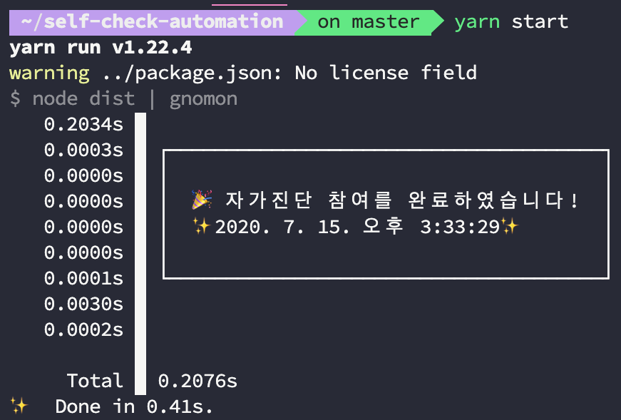
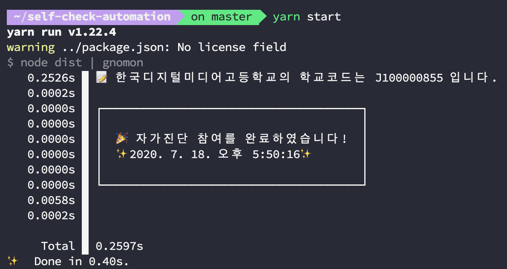

# Self Check Automation
🚨 **공지: 이 스크립트는 건강상의 문제가 없을 경우, 브라우저를 열고 복잡한 인증 절차를 거칠 필요 없이 하나의 명령어로 빠르게 자가진단을 마치기 위해서 개발되었습니다. 실행 전 반드시 개인 건강상태를 확인해주시길 바랍니다.**

> **경기도교육청의 학생 건강상태 자가진단을 위한, 빠르고 가벼운 자동화 스크립트입니다.**
>
> Blazing fast COVID-19 Self-diagnosis check for Gyeonggi-do schools




## 🔍 Why


- 맨날 들어가서 체크하기 귀찮고 실수로 빼먹었다가 갈굼당하면 속상합니다.

- 이미 존재하는 같은 목적의 다른 프로그램들은 셀레니움 등을 이용해 브라우저를 제어하는 방식으로 구현되어 있기 때문에 불필요한 메모리를 많이 사용하고, 속도도 느려서 피곤합니다.

- 학교 코드는 또 뭘까 처챠ㅑ메...

## 🚀 Usage

### 1. Clone repo
```bash
# 깃허브에서 프로젝트를 클론합니다.
git clone https://github.com/junhoyeo/self-check-automation
cd self-check-automation
```

### 2. Update credentials
```json
{
  "schoolCode": "J100000855",
  "schoolName": "한국디지털미디어고등학교",
  "studentName": "여준호",
  "studentBirth": "030704"
}
```

[credentials.json](./credentials.json)에 개인정보를 입력합니다.

| 필드명 | 설명 | 타입 | 필수 :white_check_mark:/❌ |
| ---- | --- | --- | ------- |
| `schoolCode` | 학교 코드 | `string` | ❌ |
| `schoolName` | 학교 이름 | `string` | :white_check_mark: |
| `studentName` | 사용자 이름 | `string` | :white_check_mark: |
| `studentBirth` | 사용자 생년월일(`yyMMdd`로 6자리 숫자) | `string` | :white_check_mark: |
| `schoolRegion` | 사용자가 근무하는 학교의 시/도(광역시, 시, 도, 특별자치시 구분) | `string` | :white_check_mark: |


#### 잠깐, 학교 코드를 모르셔도 괜찮아요!
**학교 코드**란 교육행정정보시스템(나이스)에서 각 학교를 구분하기 위해 내부적으로 사용하는 값입니다.<br />
그렇기 때문에 사용자 입장에서는 존재조차 모르는 경우가 많고, 실제로도 굳이 알고 있을 필요가 없습니다.



> 학교 이름만 정확히 입력하셨다면, 자동으로 학교 코드를 찾아 체크에 사용합니다.

> 한번 입력하면, credentials.json에 학교 코드가 자동으로 대입됩니다.
### 3. Build & Run

```bash
# credentials.json을 편집한 뒤, 타입스크립트를 컴파일합니다.
# 수정이 발생하지 않는다면, 다시 빌드할 필요가 없습니다.
yarn
yarn build

# 스크립트를 실행합니다.
yarn start
```

## 👽 Furthermore

### Todo

- [ ] 학교 코드 검색 시, 정확한 학교명이 아닌 검색어를 사용했을 경우를 생각해 코드와 함께 제공되는 학교 이름을 가져오도록 하기
- [x] 검색한 학교 코드를 다음 실행 시에 바로 사용할 수 있도록 `credentials.json`에 저장하기
- [x] 경기도 외 다른 교육청도 지원
